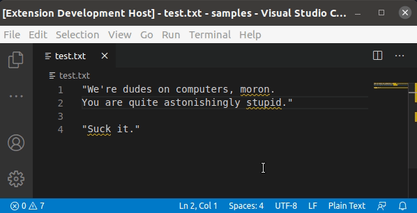

# Text toxicity classification on VS Code

  

Putting together [VS Code extension](https://code.visualstudio.com/api), [express](https://expressjs.com/), [tensorflow.js](https://github.com/tensorflow/tfjs), and a text [toxicity classifier](https://github.com/tensorflow/tfjs-models/tree/master/toxicity) into a simple project.

Just for fun. :P

## Modules

1. `client`: Activate the VS Code extension by initializing the express server and establishing a connection with the language server.

1. `server`: Language server side responsible for validating the text document and reporting back the diagnostics to the client.

1. `express`: Simple express server on port 3000 to classify text through POST requests.

## Running the example

- Open this example in VS Code 1.43+
- Initialize with `npm run init`
- Build with `npm run watch` or `npm run compile` or press `Ctrl+Shift+B`
- `F5` to start debugging

Open a text file with some content or type stuff.

VS Code will detect whether text contains toxic content such as threatening language, insults, obscenities, identity-based hate, or sexually explicit language.

**Note**: The model will be loaded on the first time a text document is opened. This operation takes a few seconds.
